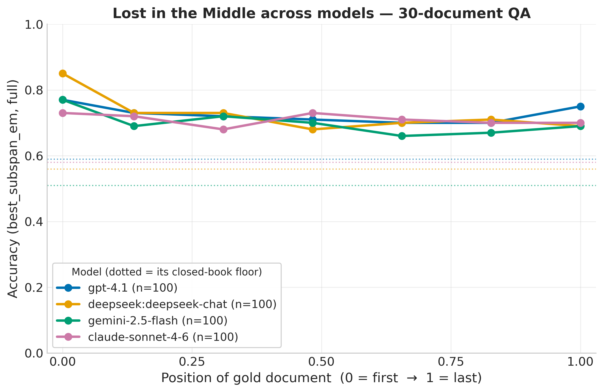

# Does "Lost in the Middle" still hold for 2026 frontier LLMs?

A modernized fork of [*Lost in the Middle: How Language Models Use Long Contexts*](https://arxiv.org/abs/2307.03172) (Liu et al., TACL 2024).

The original paper showed a striking **U-shaped** curve: in 2023, models answered best when the relevant document sat at the **start or end** of the context and worst when it was buried in the **middle** — a 15–25 point accuracy drop.

**This project asks the obvious 2026 question: is that still true?** We re-run the paper's exact position-bias experiments — same NQ-open multi-document QA prompts, same `best_subspan_em` metric — against today's **hosted frontier API models** (OpenAI, Anthropic, Google, and DeepSeek) instead of the 2023 open-weight models, and ask not just *whether* the effect survives but *where it went*.

---

## Findings so far

**TLDR: lost-in-the-middle didn't vanish — it *shrank* and *went model-specific*, and it *re-emerges* once the context gets long enough.**

At the original benchmark's lengths (10/20/30 docs, ≤~5K tokens), the dramatic 2023 U-shape is gone — accuracy spreads across positions are now just **0.07–0.11** (full-answer `best_subspan_em`, n=100/position) versus the paper's 0.15–0.25. But the four non-reasoning chat models we tested **do not flatten the same way** — each keeps a different residual position bias:

| Model | Position-bias signature (10/20/30-doc QA) |
|---|---|
| **claude-sonnet-4-6** | **flat** — most position-robust |
| **deepseek-chat** | **primacy spike** — gold-at-start ≫ rest |
| **gemini-2.5-flash** (thinking off) | **deepening middle dip** as docs grow |
| **gpt-4.1** | **symmetric U** — recovers at the end (recency) |



*Full-answer `best_subspan_em` vs. gold-document position (0 = start → 1 = end), 30-doc QA, n=100/position; dotted lines are each model's closed-book floor.*

And when we push the context longer (a **scaling tier** at 50 / 100 / 200 docs), the U-shape **comes back**: deepseek-chat (50/100/200 docs) and gemini-2.5-flash (50 docs) both show a clean asymmetric U return, with spreads of **0.11–0.14**. The phenomenon moved right on the context-length axis, exactly as hypothesized.

Two methodological points the data forced (both matter for anyone re-running this):

1. **The paper's first-line metric understates chat models.** Modern models open with a Markdown heading/preamble, so the gold span often isn't on line 1. We report **both** the paper-faithful first-line metric and a lenient full-answer metric everywhere; the gap is large for verbose models (~0.30 for Sonnet) and small for terse ones (~0.06–0.12 for deepseek/gemini).
2. **NQ-open is contaminated.** Closed-book accuracy (no documents at all) is **0.51–0.59** across models — so half of the questions are answerable from
   parametric memory, and part of every "robust" curve is recall, not long-context reading. Every curve here is reported against its closed-book floor.

## In progress / what's next

The current results are at **n=100**, where the short-context spreads (0.07–0.11) sit near the statistical noise floor — so the model-specific signatures above are **suggestive, not yet established**. The roadmap is:

1. **Bootstrap CIs at N≥300** — the gate on every shape claim made so far.
2. **A reasoning model** (GPT-5.1 / Claude extended-thinking / Gemini-thinking) — everything run so far is non-reasoning chat; the open question is *"does test-time reasoning flatten the dip?"*
3. **Finish the scaling tier** — gemini 200/500 docs, 500 docs on a long-context model, and a second model's full 50/100/200 sweep to pair with deepseek.
4. **Depth tier** — multi-fact / multi-hop retrieval and NoLiMa-style hard
   distractors, where position bias is expected to re-amplify.

---

## Running it (no GPU required)

```sh
pip install -e .          # lightweight deps — enough for the API experiments
```

Set an API key in a local `.env` (gitignored): `ANTHROPIC_API_KEY`, `OPENAI_API_KEY`, `GEMINI_API_KEY`, and/or `DEEPSEEK_API_KEY`. The provider is inferred from the model name (`gpt-*`/`o*` → OpenAI, `claude-*` → Anthropic, `gemini-*` → Google, else `provider:model`, e.g. `deepseek:deepseek-chat`).

```sh
# One QA position run (gold document at index 0, 20-document setting):
python ./scripts/get_qa_responses_from_api.py \
  --input-path qa_data/20_total_documents/nq-open-20_total_documents_gold_at_0.jsonl.gz \
  --model gpt-4.1 --max-examples 100 --num-workers 2 \
  --output-path qa_predictions/20_total_documents/...gold_at_0-gpt-4.1-predictions.jsonl.gz

# Score into per-model CSV/JSON summaries:
python ./scripts/summarize_qa_results.py --model gpt-4.1 --num-documents 20 --gold-indices 0 4 9 14 19

# Baselines (oracle ceiling + closed-book floor) and the cross-model figure:
python ./scripts/summarize_qa_baselines.py --model gpt-4.1
python ./scripts/plot_model_comparison.py \
  --models gpt-4.1 deepseek:deepseek-chat gemini-2.5-flash claude-sonnet-4-6 --num-documents 30
```

Key scripts added by this fork (under [`scripts/`](./scripts/)): `get_{qa,kv}_responses_from_api.py` (inference), `summarize_qa_results.py` /
`summarize_qa_baselines.py` (scoring), `plot_results.py` / `plot_qa_comparison.py` / `plot_model_comparison.py` (figures), with the provider-agnostic client in [`src/lost_in_the_middle/api_models.py`](./src/lost_in_the_middle/api_models.py).
Per-model summaries and figures are written under [`results/`](./results/).

---

## Data

[`qa_data/`](./qa_data/) ships the oracle (1 gold doc) and 10/20/30-document NQ-open settings; the longer 50–500-document sets are generated from the Contriever retrieval file (see [EXPERIMENTS.md](./EXPERIMENTS.md) and `make_qa_data_from_retrieval_results.py`). [`kv_retrieval_data/`](./kv_retrieval_data/) ships the synthetic key-value retrieval
sets (75/140/300 keys).

## References

This fork builds directly on the original work; please cite it:

```
@misc{liu-etal:2023:arxiv,
  author    = {Nelson F. Liu  and  Kevin Lin  and  John Hewitt  and Ashwin Paranjape  and Michele Bevilacqua  and  Fabio Petroni  and  Percy Liang},
  title     = {Lost in the Middle: How Language Models Use Long Contexts},
  note      = {arXiv:2307.03172},
  year      = {2023}
}
```
